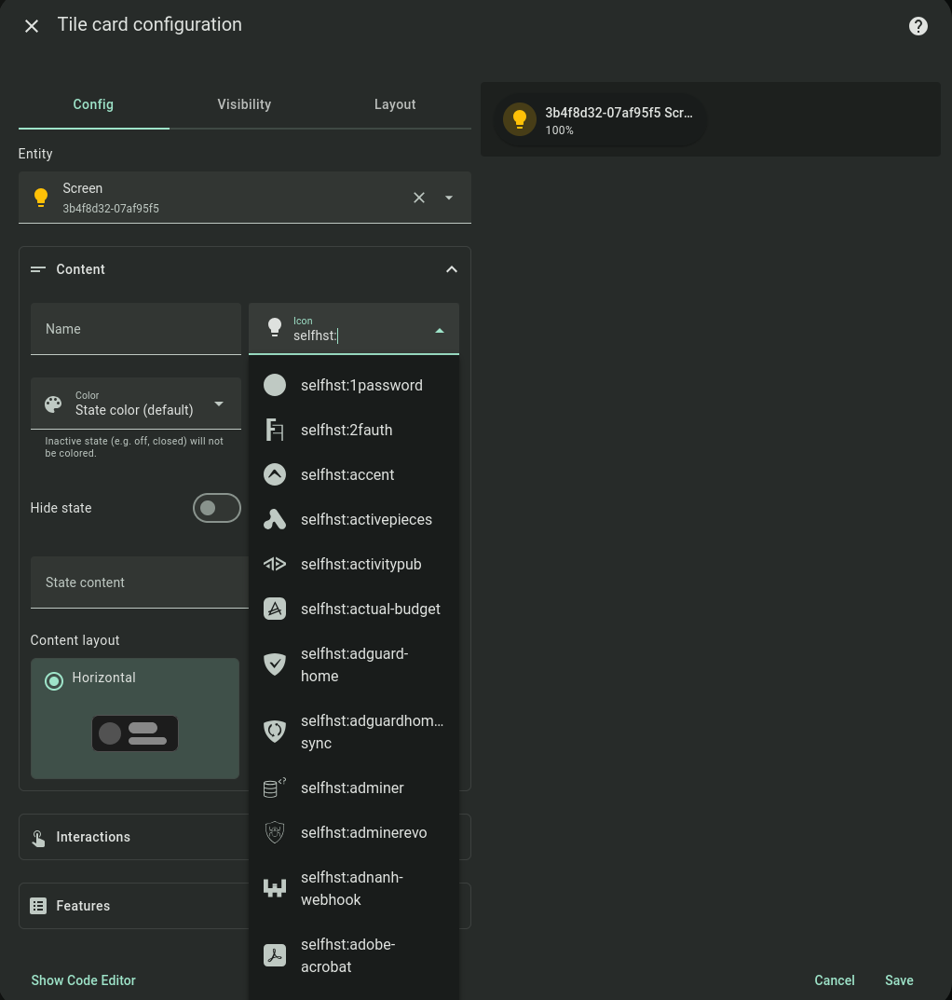

# HASS Selfh.st icons
Use icons from selfhst catalog



## Installation

### HACS

Use this link to directly go to the repository in HACS

[](https://my.home-assistant.io/redirect/hacs_repository/?owner=micash545&repository=hass-selfhst-icons)

_or_

1. Install HACS if you don't have it already
2. Open HACS in Home Assistant
3. Search for "Selfhst icons"
4. Click the download button. ⬇️

### Manual

1. Download `hass-selfhst-icons.js` file from the [latest release][release-url].
2. Put `hass-selfhst-icons.js` file into your `config/www` folder.
3. Add reference to `hass-selfhst-icons.js` in Dashboard. There's two way to do that:
    - **Using UI:** _Settings_ → _Dashboards_ → _More Options icon_ → _Resources_ → _Add Resource_ → Set _Url_ as `/local/hass-selfhst-icons.js` → Set _Resource type_ as `JavaScript Module`.
      **Note:** If you do not see the Resources menu, you will need to enable _Advanced Mode_ in your _User Profile_
    - **Using YAML:** Add following code to `lovelace` section.
        ```yaml
        frontend:
          extra_module_url:
            - /local/hass-selfhst-icons.js
        ```

## Usage
You must prefix icon name with `selfhst:`.

For example for Arch Linux icon:
```
selfhst:arch-linux
```

## Acknowledgements
- Special thanks to @selfhst for creating this awesome [icons collection](https://github.com/selfhst/icons).


## Disclaimer
Icons are the property of **@selfhst**. Use them respectfully and according to their license.
